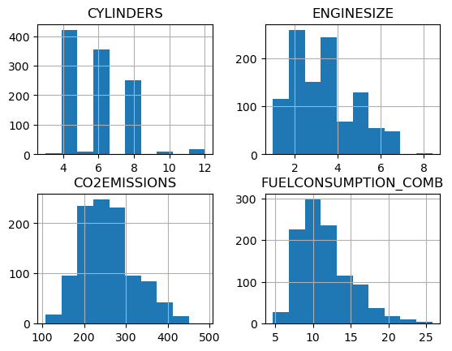
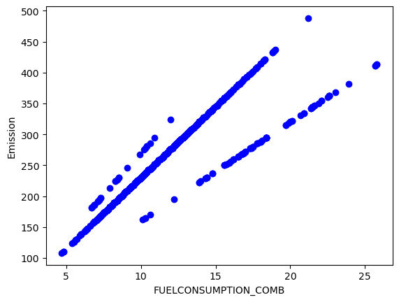
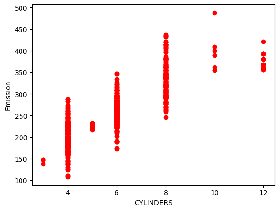
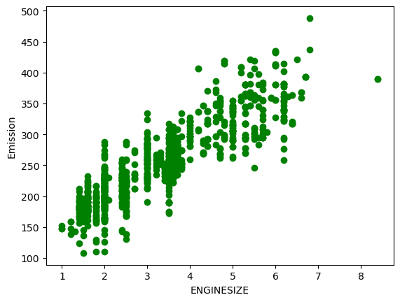

## $$co_{2} emissions$$


In this report, a machine learning regression system is designed and implemented to compute the Co<sub>2</sub> emissions of vehicles.
The dataset that was used for this experiment can be downloaded from this site. [FuelConsumption](https://open.canada.ca/data/en/dataset/98f1a129-f628-4ce4-b24d-6f16bf24dd64?utm_medium=Exinfluencer&utm_source=Exinfluencer&utm_content=000026UJ&utm_term=10006555&utm_id=NA-SkillsNetwork-Channel-SkillsNetworkCoursesIBMDeveloperSkillsNetworkML0101ENSkillsNetwork20718538-2022-01-01)

#### The independent variables are
- MODELYEAR
- MAKE 
- MODEL
- VEHICLE CLASS
- ENGINE SIZE
- CYLINDERS
- TRANSMISSION
- FUEL CONSUMPTION in CITY(L/100 km)
- FUEL CONSUMPTION in HWY (L/100 km)
- FUEL CONSUMPTION COMB (L/100 km)
- CO2 EMISSIONS (g/km)

#### The dependent variable is 
- CO2 EMISSIONS (g/km)
#### Tools
To implement the proposed system, four main libraries need to be downloaded. These libraries are listed below.
Libraries and frameworks

- [Pandas](https://pandas.pydata.org/)
- [Numpy](https://numpy.org/)
- [Matplotlib](https://matplotlib.org/)
- [scikit-learn](https://scikit-learn.org/stable/)

Import the main libraries and functions


```python
import matplotlib.pyplot as plt
import pandas as pd
import numpy as np
```

take a look at the dataset


```python
df = pd.read_csv("FuelConsumption.csv")
df.head(3)
```


<div>

<table border="1" class="dataframe">
  <thead>
    <tr style="text-align: right;">
      <th></th>
      <th>MODELYEAR</th>
      <th>MAKE</th>
      <th>MODEL</th>
      <th>VEHICLECLASS</th>
      <th>ENGINESIZE</th>
      <th>CYLINDERS</th>
      <th>TRANSMISSION</th>
      <th>FUELTYPE</th>
      <th>FUELCONSUMPTION_CITY</th>
      <th>FUELCONSUMPTION_HWY</th>
      <th>FUELCONSUMPTION_COMB</th>
      <th>FUELCONSUMPTION_COMB_MPG</th>
      <th>CO2EMISSIONS</th>
    </tr>
  </thead>
  <tbody>
    <tr>
      <th>0</th>
      <td>2014</td>
      <td>ACURA</td>
      <td>ILX</td>
      <td>COMPACT</td>
      <td>2.0</td>
      <td>4</td>
      <td>AS5</td>
      <td>Z</td>
      <td>9.9</td>
      <td>6.7</td>
      <td>8.5</td>
      <td>33</td>
      <td>196</td>
    </tr>
    <tr>
      <th>1</th>
      <td>2014</td>
      <td>ACURA</td>
      <td>ILX</td>
      <td>COMPACT</td>
      <td>2.4</td>
      <td>4</td>
      <td>M6</td>
      <td>Z</td>
      <td>11.2</td>
      <td>7.7</td>
      <td>9.6</td>
      <td>29</td>
      <td>221</td>
    </tr>
    <tr>
      <th>2</th>
      <td>2014</td>
      <td>ACURA</td>
      <td>ILX HYBRID</td>
      <td>COMPACT</td>
      <td>1.5</td>
      <td>4</td>
      <td>AV7</td>
      <td>Z</td>
      <td>6.0</td>
      <td>5.8</td>
      <td>5.9</td>
      <td>48</td>
      <td>136</td>
    </tr>
  </tbody>
</table>
</div>


Summarize the data


```python
df.describe().mean()
```


    MODELYEAR                   1643.875000
    ENGINESIZE                   136.357774
    CYLINDERS                    138.449025
    FUELCONSUMPTION_CITY         144.699723
    FUELCONSUMPTION_HWY          141.477389
    FUELCONSUMPTION_COMB         143.227059
    FUELCONSUMPTION_COMB_MPG     156.238766
    CO2EMISSIONS                 341.825123
    dtype: float64


Select some features


```python
cdf = df[['ENGINESIZE','CYLINDERS','FUELCONSUMPTION_COMB','CO2EMISSIONS']]
```


```python
viz = cdf[['CYLINDERS','ENGINESIZE','CO2EMISSIONS','FUELCONSUMPTION_COMB']]
viz.hist()
```


    array([[<AxesSubplot:title={'center':'CYLINDERS'}>,
            <AxesSubplot:title={'center':'ENGINESIZE'}>],
           [<AxesSubplot:title={'center':'CO2EMISSIONS'}>,
            <AxesSubplot:title={'center':'FUELCONSUMPTION_COMB'}>]],
          dtype=object)


    

    


Plot each of these features against the Emission, to see how linear their relationship

1- FUELCONSUMPTION_COMB with CO2EMISSIONS


```python
plt.scatter(cdf.FUELCONSUMPTION_COMB, cdf.CO2EMISSIONS,  color='blue')
plt.xlabel("FUELCONSUMPTION_COMB")
plt.ylabel("Emission")

```


    Text(0, 0.5, 'Emission')


    

    


2- CYLINDERS with CO2EMISSIONS


```python
plt.scatter(cdf.CYLINDERS, cdf.CO2EMISSIONS,  color='red')
plt.xlabel("CYLINDERS")
plt.ylabel("Emission")

```


    Text(0, 0.5, 'Emission')


    

    


3- ENGINESIZE with CO2EMISSIONS


```python
plt.scatter(cdf.ENGINESIZE, cdf.CO2EMISSIONS,  color='green')
plt.xlabel("ENGINESIZE")
plt.ylabel("Emission")

```


    Text(0, 0.5, 'Emission')


    

    


Creating a train and test dataset by randomly selecting 80% of the data for training and 20% for testing. 


```python
msk = np.random.rand(len(df)) < 0.8
train = cdf[msk]
test = cdf[~msk]
```


```python
from sklearn import linear_model
regr = linear_model.LinearRegression()
train_x = np.asanyarray(train[['ENGINESIZE']])
train_y = np.asanyarray(train[['CO2EMISSIONS']])
regr.fit(train_x, train_y)
# The coefficients
print ('Coefficients: ', regr.coef_)
print ('Intercept: ',regr.intercept_)

```

    Coefficients:  [[38.61324843]]
    Intercept:  [126.86355405]
    

Evaluate the system 


```python
from sklearn.metrics import r2_score
test_x = np.asanyarray(test[['ENGINESIZE']])
test_y = np.asanyarray(test[['CO2EMISSIONS']])
test_y_ = regr.predict(test_x)
```


```python
print("Mean absolute error: %.2f" % np.mean(np.absolute(test_y_ - test_y)))
print("Residual sum of squares (MSE): %.2f" % np.mean((test_y_ - test_y) ** 2))
print("R2-score: %.2f" % r2_score(test_y , test_y_) )
```

    Mean absolute error: 24.30
    Residual sum of squares (MSE): 1017.53
    R2-score: 0.77
    

With the same process, they compute the results using FUELCONSUMPTION_COMB and CYLINDERS as independent variables. The figures below show the main difference.


#### Conclusion

In the experiment, the CO2 emissions system is proposed based on the linear regression system. The proposed system is implemented and designed using the Python programming language. Three independent variables are used (engine size, number of cylinders, and fuel consumption). Three evaluation metrics are used to compute the results (MES, MAE, and R2_score). The findings show that using fuel consumption as an independent variable is more efficient than other ones since it achieves higher performance. The R2-score for the number of cylinders used was 69%, and the engine size was 76%, while the R2-score for fuel consumption was 77%. 
